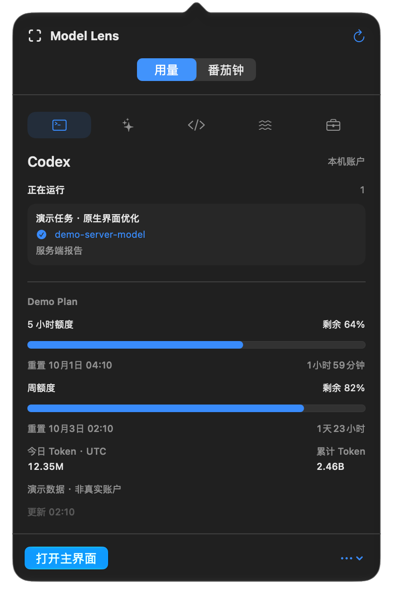
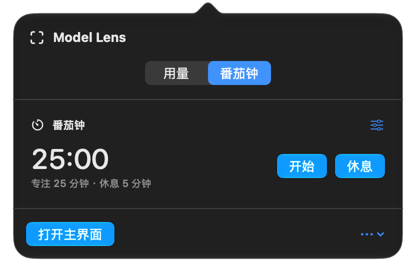

# Codex Model Lens

**一个轻量的原生 macOS 菜单栏应用：查看 Codex 任务的模型证据、Agent 用量与费用，并管理专注时间。**

Swift · SwiftUI / AppKit · macOS 26+ · Apple Silicon · MIT

[下载 Release](https://github.com/TakimotoUki/Codex-Model-Lens/releases/latest) · [介绍网站](https://takimotouki.github.io/Codex-Model-Lens/) · [安全与隐私](SECURITY.md) · [贡献者](AUTHORS.md)

> **模型识别的边界：** 软件能读取服务端明确报告的模型字段和路由事件，并检测其与请求模型的差异。它不能证明服务端运行的模型权重，也无法从未保存、未公开的字段恢复任意现有任务的真实模型。没有有效证据时显示“模型未确认”。独立核验只说明该次核验请求。

<p align="center"> </p>

## 功能

- **默认只出现在菜单栏。** 启动时没有 Dock 图标和主窗口；明确点击“打开主界面”才打开三栏 Codex 任务工作区。设置、账户与用量面板可直接从菜单打开。
- **Codex 模型证据。** 当前和历史任务、轮次请求模型、服务端响应 `model`、`openai-model` / `x-openai-model` 以及明确 `model/rerouted` 事件；保留来源、时间、响应 / 请求 ID。不能确定关联的事件不按时间猜测归属。
- **请求诊断。** 区分 `at capacity` 文字、`server_is_overloaded` 错误、失败请求、HTTP 状态与安全缓冲；保存本机日志覆盖时间。计数差异本身不能证明客户端撒谎或替换了模型。
- **历史。** 本地原子保存、增量读取、JSON / CSV 导出、模型证据导入。移除本地任务后后续扫描跳过它，原始 Codex 会话保留。损坏或更新版本的历史文件不会被静默覆盖。
- **独立模型核验。** 手动确认后用签名验证过的官方 CLI 发送一个 `pong` 测试，捕获原始入站响应的模型字段，区分预热响应和有输出的响应。会消耗少量 Codex 额度；从不自动发送。
- **多平台用量。** 五个平台可独立开启和关闭；仅所选、启用的平台按需读取。菜单参考 CodexBar 的紧凑组织方式，采用系统蓝色与原生 Liquid Glass 控件。
- **Add Account。** Codex 登录文件、DeepSeek API Key、OpenCode Go API Key 或手动工作区 Cookie；随机账户 ID，钥匙串保存凭据，账户缓存分别保存。Antigravity / WorkBuddy 使用本机 Agent 当前登录。
- **Cost / Usage Dashboard。** 区分余额、已记录费用、积分和手动价格估算；按账户保存最近 90 天的成功用量快照，累计 Token 图表明确标明计量范围。
- **Status Page / About。** 官方服务状态或产品页面、版本、开源链接和贡献署名。
- **独立番茄钟。** 自定义专注 1–240 分钟、休息 1–120 分钟，暂停、恢复、结束；菜单栏显示 `MM:SS` 并逐秒更新。使用截止时间计算，休眠后修正，时间到提醒；休息需手动开始。页面高度随内容调整，计时器操作不会刷新平台用量。

## 各平台支持范围

| 平台 | 认证 / 来源 | 可显示的信息 | 明确限制 |
| --- | --- | --- | --- |
| Codex | 已登录官方桌面内置 CLI；已知文件 / Keychain 登录；可添加登录文件账户 | 套餐、服务端额度窗口、剩余比例、重置时间；官方接口可用时的累计 / 今日 UTC Token | 接口可能随版本和账户变化；订阅 Token 不是实际账单；任务模型字段不一定存在 |
| Antigravity / Gemini | 已安装、登录的签名 Google App，本机语言服务器 | `userTier` 实际套餐、quota summary 或模型额度、重置时间 | App 关闭时可后台打开；旧接口未标周期或比例时保持未知；当前接口未提供 Token 总数或成本 |
| OpenCode Go | `OPENCODE_API_KEY`、本机 `auth.json`；API Key 账户；手动 Cookie + `org_…` 工作区 | 官方 5 小时 / 周 / 月窗口（接口提供时）；本机 SQLite 最近 90 天 Token 和已记录 USD Cost；工作区余额 | 工作区账户不混入全设备历史；本机费用不能推算账户额度；缺失 Token 组成保持未知 |
| DeepSeek | API Key 账户或环境变量 | 余额、充值余额与赠送余额 | 余额 API 不提供 Token、重置或实际 Cost，不由余额变化推算这些值 |
| WorkBuddy（实验性） | 支持的本机未加密登录格式 + 官方计费接口；新版加密格式使用本机数据库后备 | 支持格式下的个人 / 企业剩余积分、积分包和重置；加密格式下按请求去重的本机已记录消耗积分 | **本机新版加密登录尚不能读取剩余余额**；不会解密其认证文件，余额请到官方“套餐与用量”查看；积分不是 Token 或货币 |

Antigravity 的 `planStatus` 可能包含旧版通用 Pro 模板，本应用优先采用实际 `userTier`，例如 **Antigravity Starter Quota**。未提供的字段不显示为零。软件不将安全缓冲的 `fasterModel` 当成已交付模型。

OpenCode Go API 的 `percent` 是 0–100 百分数，`1` 表示已用 1%。工作区 micro-cents 按接口单位换算。本机费用选择 step-finish 记录或其父消息汇总中的一种，避免重复计数；仅选择 `providerID = opencode-go` 的 assistant 记录。

## 安装和首次运行

1. 从 [Releases](https://github.com/TakimotoUki/Codex-Model-Lens/releases/latest) 下载 `Codex-Model-Lens-1.3.0-arm64.zip`，按同页校验文件检查 SHA-256。
2. 解压，将 **Codex Model Lens.app** 放入 Applications（系统或用户 Applications 均可）。不需要 Python、Node、Homebrew 或外部 Swift 包。
3. 打开 App，在菜单栏找到取景框图标。点击它查看 Codex；通过“设置…”开启其他平台。
4. 安装并登录对应的 Agent。Codex 通常使用 `~/.codex`；自定义 `CODEX_HOME` 可通过设置选择。Antigravity 需有可访问的本机登录语言服务；软件可在后台打开已安装 App。
5. 如果 macOS 请求访问对应登录的钥匙串项，按系统提示确认。DeepSeek / OpenCode 的额外账户通过 **Add Account** 添加。
6. 开始番茄钟时允许通知。拒绝通知权限时，App 仍运行期间会用原生提醒框和声音提示；退出 App 后该后备提示不可用。

**本次二进制采用 ad-hoc 签名，未进行 Apple Developer ID 公证。** 新下载的 App 可能被 Gatekeeper 拦截；检查来源后可在系统“隐私与安全性”中按 Apple 提供的单应用方式允许打开。请勿关闭整个系统的安全检查。后续维护者可使用自己的 Developer ID 签名并公证。签名检查通过不等于已经公证。

## 使用

菜单的“用量 / 番茄钟”切换保持各自状态。平台按钮选择当前平台；有额外账户时显示账户选择器。刷新只针对当前平台，Codex 同时刷新本机任务。用量默认缓存 5 分钟；缓存保留原读取时间，失败不会假装更新成功。

Token 以 `k`（千）、`M`（百万）、`B`（十亿）显示：`12,345,678 → 12.35M`，`2,456,789,000 → 2.46B`。达到一亿时切入 `B`，所以一亿显示 `0.1B`。完整记录在导出的历史文件中；不将紧凑显示的四舍五入值用于统计。

“打开主界面”显示正在运行、全部任务、模型变化、安全缓冲和检测历史。运行状态来自本机客户端及近期未结束轮次活动；长时间没有本机活动的记录显示“活动待确认”，它不是后台任务的绝对真值。其他设备和未保存的云端会话不在本机覆盖范围。

在 **Cost** 输入 USD / 1M Token 的价格后，可对具有完整输入 / 缓存输入 / 输出组成的 Codex 本机任务进行价格估算。统一价格不代表实际路由模型的价格，更不是订阅账单。默认价格为零，不自动抓取可能过期的价格。

**Usage Dashboard** 展示已成功读取的账户快照和可用图表，每账户每天保存最后一次成功快照，保留 90 天。累计 Token 曲线不能当成每日 Token 增量。仅本机设备记录会在来源和说明中明确标注。

## 模型检测为什么有时未确认？

本机配置和轮次上下文只能说明请求了什么模型。真正可用的观察值是带明确关联的服务端模型字段或路由事件。普通 Codex 历史并不保证保存这些字段；服务端不公开的信息无法由本机软件补出。

独立核验在私有临时目录复制当前登录，使用独立工作目录与配置，不继承用户 hooks / MCP / 规则，并禁用 shell、app、web search 和多 Agent 功能；只保存白名单模型字段、响应 ID、时间和状态，不保存原始回复、认证头或完整 trace。结束和取消后清理临时文件。它不会监控已有桌面连接，也不会把该次结果套用到其他任务。

预热响应没有实际输出，不参与交付模型判断。没有输出归属、响应未完成、失败、超时、冲突字段或缺少模型时，核验保持未确认。只有本机日志不能证明服务端权重是否被替换，详见 [安全边界](SECURITY.md)。

## 数据存放与隐私

正常运行数据位于：

```text
~/Library/Application Support/Codex Model Lens/
  settings.json                 本机检测设置
  model-history.json            任务与请求证据历史
  model-probes.json              手动核验记录
  pomodoro.json                  计时状态与自定义时长
  usage-preferences.json         平台开关、账户标签与选定账户（无秘密）
  usage-history.json             用量元数据快照
  ImportedEvidence/              导入后仅含白名单字段的证据
  PrivateRuns/                   活跃 CLI 的临时私有登录目录，用后清理
```

手动账户凭据保存在 **macOS Keychain**。旧版 App 旁边的 `Data` 中有历史时，首次运行会复制受支持的历史文件到 Application Support，原文件保留。测试可用 `--data-directory` 显式隔离。

任务标题、工作目录和来源路径可能属于私人资料；导出前自行检查。软件没有遥测、广告、后台自动模型测试、浏览器密码提取或静默下载执行更新。原始 Agent 数据使用只读数据库访问。完整细节见 [SECURITY.md](SECURITY.md)。

## 从源码构建

需要 Apple Silicon Mac、macOS 26+ 和 Swift 6.2+ / macOS 26 SDK（Xcode 或适用的 Command Line Tools）。

```sh
git clone https://github.com/TakimotoUki/Codex-Model-Lens.git
cd Codex-Model-Lens
./Scripts/test.sh
./Scripts/build_release.sh
```

产物：`Distribution/Build-1.3/Codex Model Lens.app`、ZIP 和辅助 CLI。构建脚本优先选择安装的 macOS 26 SDK，所有缓存位于项目 `.build`，生成 arm64 包。CLI-only SwiftPM 当前使用 native 构建后端；其弃用提示不影响本次产物。

脚本默认 ad-hoc 签名。维护者可以设置 `MODEL_LENS_SIGNING_IDENTITY` 使用可用签名身份，再自行完成 Apple 公证流程。应用从 NSWorkspace 与标准安装位置发现 Agent，不包含开发者的绝对家目录。

辅助 CLI：

```sh
Distribution/model-lens --summary
Distribution/model-lens --home /path/to/codex-home --client-offline --summary
Distribution/model-lens --account --data-directory ./Data/PrivateQA --output ./Data/codex-usage.json
Distribution/model-lens --provider antigravity --output ./Data/antigravity-usage.json
```

GUI 演示 / UI QA（显式假数据，不发起用量网络请求）：

```sh
'Distribution/Build-1.3/Codex Model Lens.app/Contents/MacOS/CodexModelLens' \
  --demo --data-directory ./Data/Demo --preview-menu \
  --preview-path ./Data/menu-demo.png
```

`--preview-timer`、`--preview-countdown`、`--demo-empty`、`--preview-light`、`--preview-diagnostics`、`--preview-utility settings` 可组合检查。截图只捕获本应用自己的可用窗口。

## 验证与维护

实现采用增量文件游标、复用读取缓冲、只读 SQLite、按需账户读取、截止时间计时、原子写入和后台扫描。菜单栏背景扫描至少间隔 15 秒，Codex 关闭时 60 秒；计时器空闲或暂停时没有秒级 ticker，状态文件不每秒写入。

测试覆盖模型关联、伪装提示排除、安全缓冲边界、预热 / 实际输出区分、冲突响应字段、历史损坏保护、增量文件替换、Token 溢出 / 单位、平台解析、费用去重与计时恢复。真实数据源与 UI / 性能验证见 [VALIDATION-1.3.md](Documentation/VALIDATION-1.3.md)。未具有凭据的平台使用离线结构测试；接口版本变化应按真实来源更新解析器。代码审核和测试不等于证明不存在任何漏洞。

源代码公开前排除 `Data`、构建缓存、发行产物、私人探测文件、原始日志和实际账户截图。Release 仅含 App；用户数据不会随安装包发布。

## 贡献与许可

MIT License。项目所有者与产品设计：**[TakimotoUki](https://github.com/TakimotoUki)**；实现、研究、测试、文档与网站：在用户指示下与 **Codex AI** 协作。详见 [AUTHORS.md](AUTHORS.md)。

感谢 [CodexBar](https://github.com/steipete/CodexBar) 的界面组织与公开数据源研究；本应用增加 Codex 模型证据工作区与独立番茄钟。相关来源与授权说明见 [THIRD-PARTY-NOTICES.md](THIRD-PARTY-NOTICES.md)。
